# 🛒 Superstore Sales Analysis

## 👥 Team: Analytics Avengers

## 🛠️ Tools Used
- Microsoft Excel (Microsoft Excel, Power Query Editor, Pivot Tables & Pivot Charts)

## 📌 Summary

This project is a comprehensive sales analysis of a Superstore dataset covering the period 2014 to 2017. The analysis was carried out using Microsoft Excel, Power Query Editor, Pivot Tables & Pivot Charts. 

The dataset was structured across multiple sheets:

### Main Order
The original dataset containing all uncleaned sales records. This was cleaned and transformed to produce the Fact Order 
and all Dimension tables.

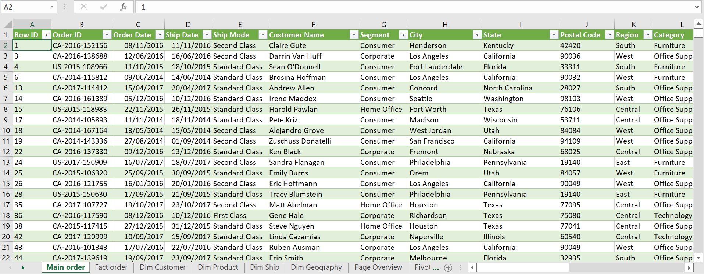

### Fact Order
Main transaction data containing all sales records

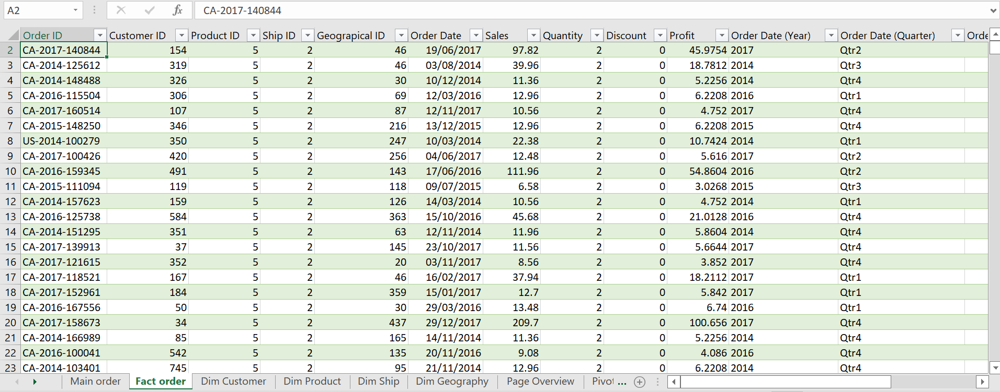

### Dim Customer
Customer details including names and segments

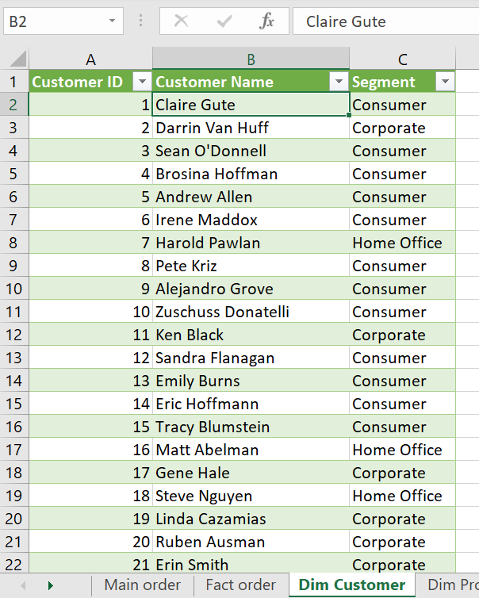

### Dim Product
Product information including category and sub-category

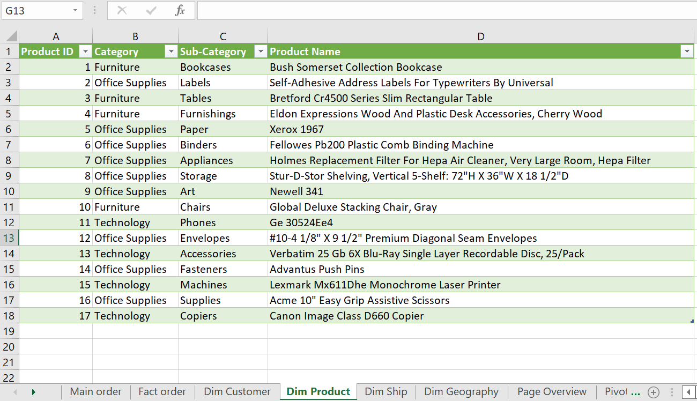

### Dim Ship
Shipping details including ship mode and dates

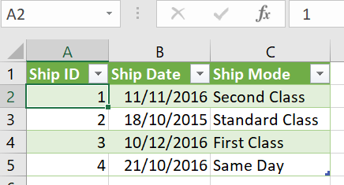

### Dim Geography
Location and regional data

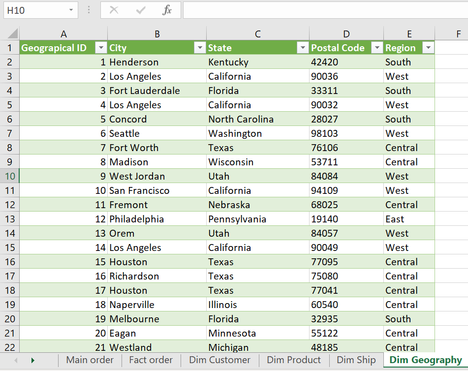

## 💡 Insights from Analysis

### 1. Profit Leakage Analysis
- Technology had the lowest discount ($112.30) yet generated the highest profit ($70,157.57), meaning discounting was well controlled.
- Office Supplies had the highest discount ($487.00) which significantly ate into its profit despite decent sales.
- Furniture had very low profit ($7,569.17) relative to its high sales ($373,504.72) meaning a major profit leakage area.
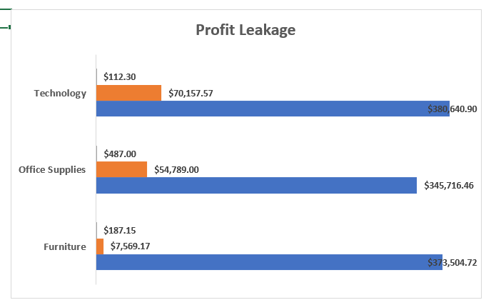

### 2. Profit by Product Category
- Technology was the most profitable category overall.
- Furniture is underperforming that is high sales but very low profit margin.
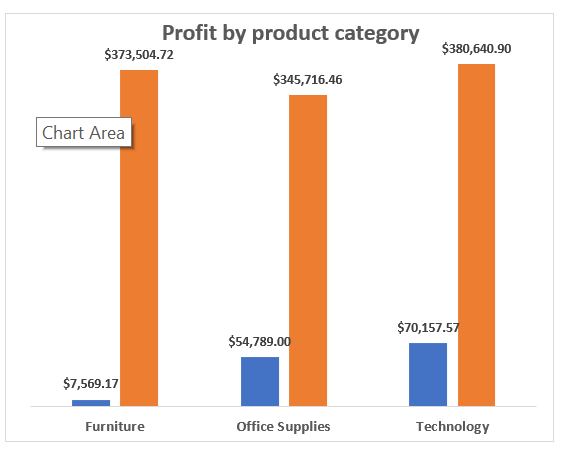

### 3. Top Performing Products
- Fellowes Pb200 Plastic Comb led with 2,977 units sold.
- The top 10 products were dominated by office supplies and technology accessories.
- No single product had a dominant lead; sales were fairly spread across top products.
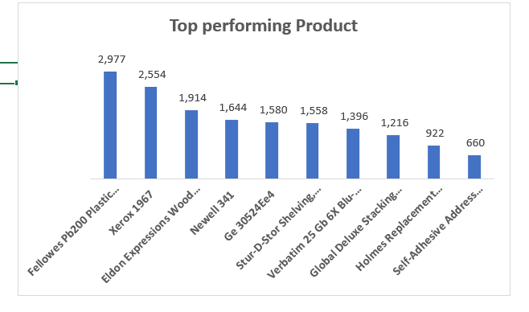

### 4. Top Performing States
- California dominated with $213,274.63 in sales that implies nearly 5x more than Virginia.
- New York came second at $148,208.76.
- Virginia had the lowest sales among top states at $38,420.15
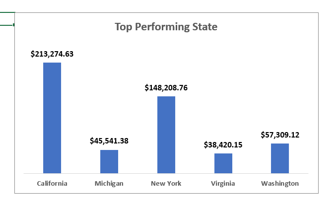

### 5. Sales by Region
- West and East regions were almost equal in sales ($332K vs $330K).
- South was the weakest region at $190,409.23.
- Central region sits mid-table at $246,314.52 and needs attention.
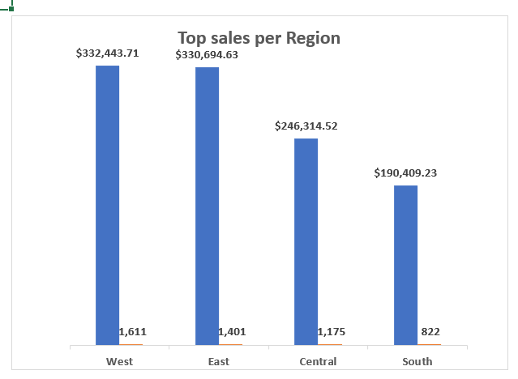

### 6. Most Performing Ship Mode
- Standard Class dominated in both quantity (11,451) and profit ($77,782.59).
- First Class and Second Class had significantly lower volumes.
- The business relies heavily on Standard Class shipping.
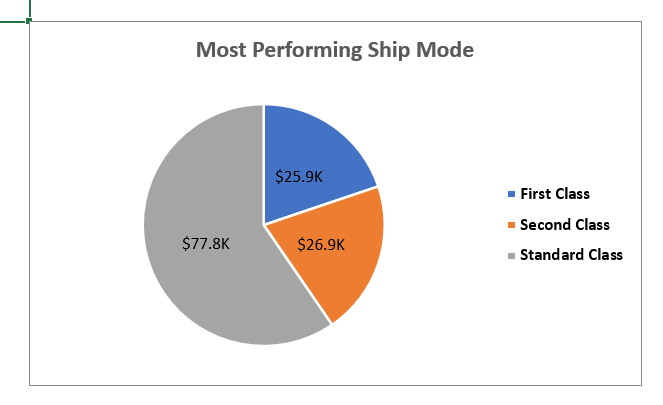

### 7. Revenue & Profit Growth Trend (2014–2017)
- Both revenue and profit grew consistently every year.
- Revenue jumped significantly from 2016 ($312,726.87) to 2017 ($357,260.29).
- Profit grew steadily, showing the business is becoming more efficient over time.
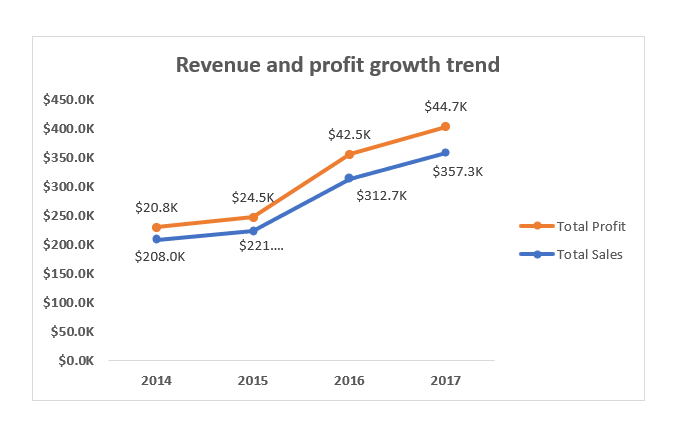

### 8. Loss-Making Products
- Bretford Cr4500 Series was the biggest loss at -$10,997.07.
- Bush Somerset Collection Bookcase and Acme 10" Easy Grip Scissors also made losses.
- All 3 loss-making products are from the Furniture category confirming Furniture is a problem area.
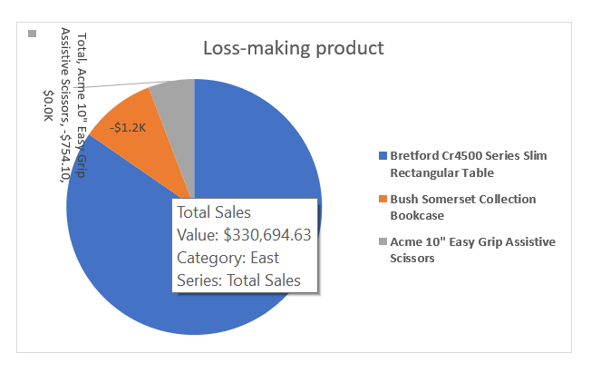

## 📊 Dashoboard
The dashboard below provides a visual summary of all key metrics and findings from the analysis.

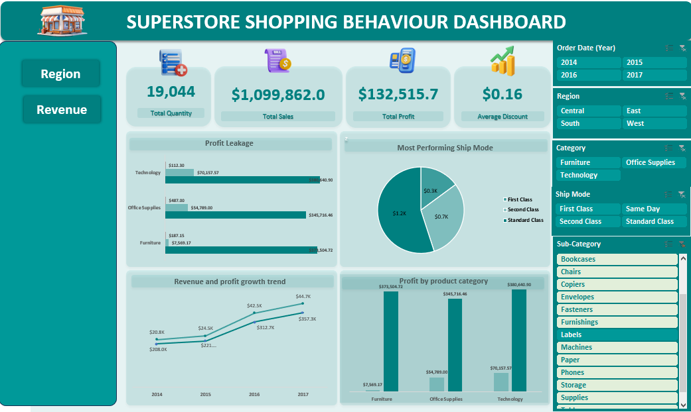
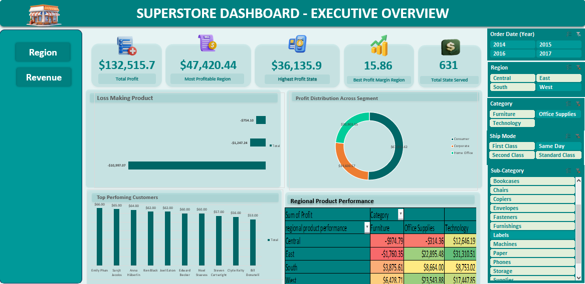

## ✅ Recommendations

- Furniture category should be reviewed therefore consider repricing or discontinuing low-margin products to reduce profit leakage.
- Technology category should be prioritized as it consistently delivers the highest profit with minimal discounting.
- South region needs a targeted sales strategy to close the gap with the West and East regions.
- Office Supplies discounting should be reviewed and controlled to protect profit margins
- Loss-making products (Bretford Cr4500, Bush Somerset, Acme Scissors) should be evaluated for discontinuation or cost reduction

## 📝 Conclusion

This analysis reveals that while the Superstore business is growing steadily from 2014 to 2017, there are clear areas of profit leakage particularly in the Furniture category. 
Technology remains the strongest performer across 
all metrics. 
With the right pricing strategy and regional focus, the business has strong potential for even greater profitability.

