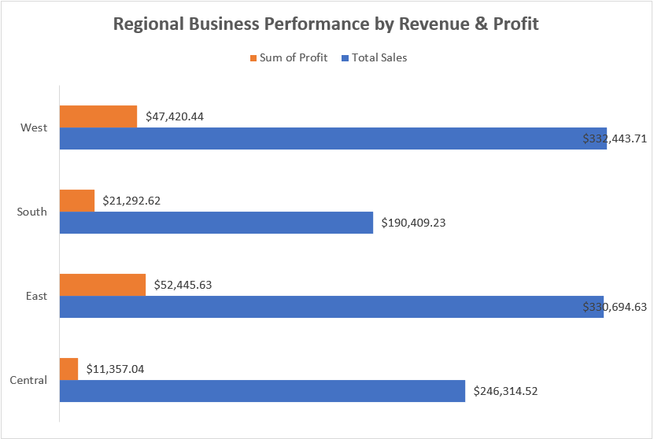
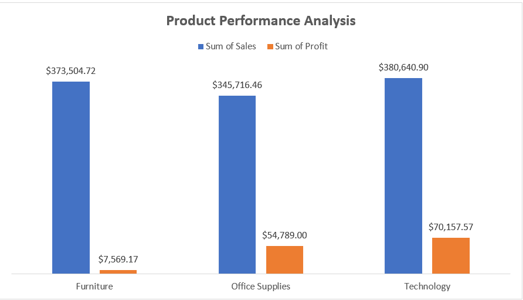
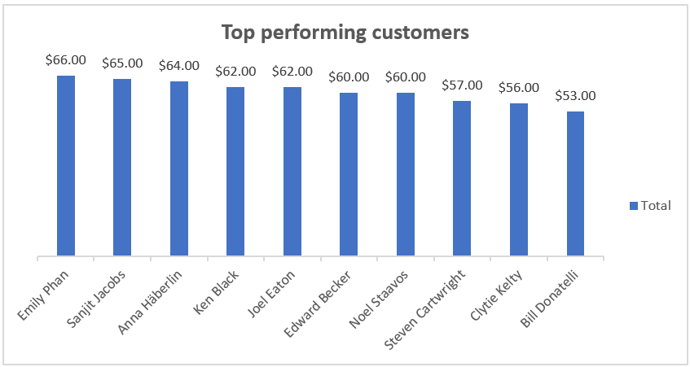

# 🛒 Superstore Sales Analysis

## 👥 Team: Analytics Avengers

## 🛠️ Tools Used
- Microsoft Excel (Microsoft Excel, Power Query Editor, Pivot Tables & Pivot Charts)

## 📌 Summary

This project is a comprehensive sales analysis of a Superstore dataset covering the period 2014 to 2017. The analysis was carried out using Microsoft Excel, Power Query Editor, Pivot Tables & Pivot Charts. 

The dataset was structured across multiple sheets:

### Main Order
The original dataset containing all uncleaned sales records. This was cleaned and transformed to produce the Fact Order 
and all Dimension tables.

### Fact Order
Main transaction data containing all sales records

### Dim Customer
Customer details including names and segments

### Dim Product
Product information including category and sub-category

### Dim Ship
Shipping details including ship mode and dates

### Dim Geography
Location and regional data

## 💡 Insights from Analysis

### 1. Profit Leakage Analysis
- Technology had the lowest discount ($112.30) yet generated the highest profit ($70,157.57), meaning discounting was well controlled.
- Office Supplies had the highest discount ($487.00) which significantly ate into its profit despite decent sales.
- Furniture had very low profit ($7,569.17) relative to its high sales ($373,504.72) meaning a major profit leakage area.

### 2. Profit by Product Category
- Technology was the most profitable category overall.
- Furniture is underperforming that is high sales but very low profit margin.

### 3. Top Performing Products
- Fellowes Pb200 Plastic Comb led with 2,977 units sold.
- The top 10 products were dominated by office supplies and technology accessories.
- No single product had a dominant lead; sales were fairly spread across top products.

### 4. Top Performing States
- California dominated with $213,274.63 in sales that implies nearly 5x more than Virginia.
- New York came second at $148,208.76.
- Virginia had the lowest sales among top states at $38,420.15

### 5. Sales by Region
- West and East regions were almost equal in sales ($332K vs $330K).
- South was the weakest region at $190,409.23.
- Central region sits mid-table at $246,314.52 and needs attention.

### 6. Most Performing Ship Mode
- Standard Class dominated in both quantity (11,451) and profit ($77,782.59).
- First Class and Second Class had significantly lower volumes.
- The business relies heavily on Standard Class shipping.

### 7. Revenue & Profit Growth Trend (2014–2017)
- Both revenue and profit grew consistently every year.
- Revenue jumped significantly from 2016 ($312,726.87) to 2017 ($357,260.29).
- Profit grew steadily, showing the business is becoming more efficient over time.

### 8. Loss-Making Products
- Bretford Cr4500 Series was the biggest loss at -$10,997.07.
- Bush Somerset Collection Bookcase and Acme 10" Easy Grip Scissors also made losses.
- All 3 loss-making products are from the Furniture category confirming Furniture is a problem area.

### 9. Regional Business Performance by Revenue & Profit
- West region led in both total sales ($332,443.71) and profit ($47,420.44)
- East region came close in sales ($330,694.63) but had higher profit 
($52,445.63) than West meaning East is more efficient
- Central region had decent sales ($246,314.52) but the lowest profit ($11,357.04) which is a major concern
- South had the lowest sales ($190,409.23) with profit of ($21,292.62).

### 10. Product Performance Analysis
- Technology dominated with the highest sales ($380,640.90) and highest profit ($70,157.57)
- Furniture had high sales ($373,504.72) but extremely low profit ($7,569.17) confirming it as the weakest category
- Office Supplies balanced well with $345,716.46 in sales and 
$54,789.00 in profit.

### 11. Top Performing Customers
- Emily Phan led as the top customer with $66.00 in quantity purchased.
- The top 10 customers had very close purchasing quantities rangeing from $53.00 to $66.00
- No single customer dominated that is purchases were evenly spread across the top 10.

### 12. Regional Product Performance
- East region led in Technology profit ($31,310.51), Office Supplies ($22,895.48) but lost money in Furniture (-$1,760.35)
- West region performed well across all categories, Furniture ($6,428.71), Office Supplies ($23,543.88) and Technology ($17,447.85)
- South region had moderate performance, Furniture ($3,875.61), Office Supplies ($8,659.02), 
Technology ($763.02)
- Central region had Technology profit ($12,646.19) but lost money in Furniture (-$974.79)
- Furniture made losses in both East (-$1,760.35) and Central (-$974.79) regions
- Office Supplies was the most consistently profitable category across all regions

- and Technology ($17,447.85)
- East region had negative profit for Furniture (-$1,760.35)  meaning Furniture is losing money in the East
- Central region also had negative Furniture profit (-$974.79)confirming Furniture is a problem across multiple regions
- West region performed well in Office Supplies ($23,543.88) 
and Technology ($6,428.71)
- Office Supplies was the most consistently profitable category across all regions.

## 📊 Dashoboard
The dashboard below provides a visual summary of all key metrics and findings from the analysis.

## ✅ Recommendations

- Furniture category should be reviewed urgently, it is making losses in Central and East regions specifically. Consider repricing or discontinuing low-margin furniture products.
- Office Supplies should be expanded across all regions as it proved to be the most consistent profit performer region by region
- Technology should also be invested in as it delivers the highest overall profit ($70,157.57).
- Central region needs immediate attention, it had the lowest profit ($11,357.04) despite decent sales ($246,314.52)
- South region should be targeted for growth, it has the lowest sales but surprisingly strong Office Supplies performance
- Office Supplies discounting should be controlled to protect its profit margins
- Loss-making products (Bretford Cr4500, Bush Somerset, Acme Scissors) should be evaluated for discontinuation or cost reduction.
- Top performing customers should be retained through loyalty programs as purchases are evenly spread with no dominant customer dominate, purchase are evenly spread across the top 10.

## 📝 Conclusion

This analysis reveals that while the Superstore business is growing steadily from 2014 to 2017, there are clear areas of 
profit leakage particularly in the Furniture category, especially in the Central and East regions.
Office Supplies proved to be the most consistent performer across all regions, while Technology delivered the highest 
overall profit.
With the right pricing strategy, regional focus, and product decisions, the business has strong potential for even greater profitability.
